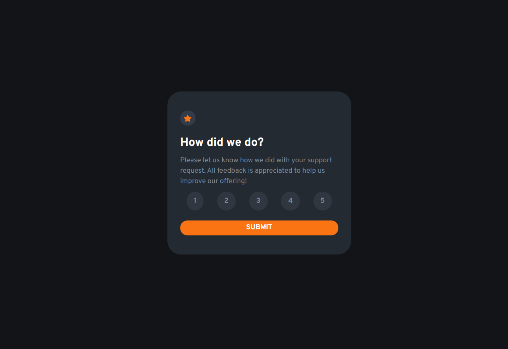
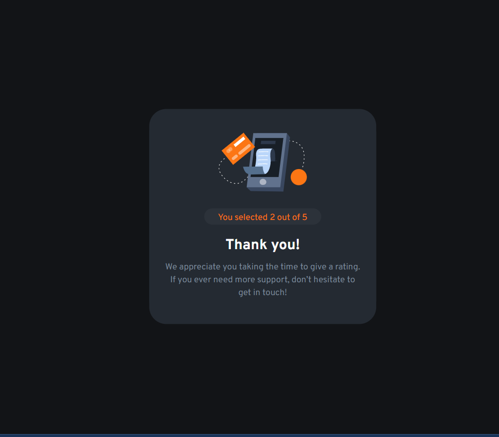

# Frontend Mentor - Interactive rating component

## Welcome! 👋

Thanks for checking out this front-end coding challenge.

# Frontend Mentor - Interactive rating component solution

This is a solution to the [Interactive rating component challenge on Frontend Mentor](https://www.frontendmentor.io/challenges/interactive-rating-component-koxpeBUmI). 

## Table of contents

- [Overview](#overview)
  - [The challenge](#the-challenge)
  - [Screenshot](#screenshot)
  - [Links](#links)
  - [Built with](#built-with)
  - [What I learned](#what-i-learned)
- [Author](#author)

## Overview

### The challenge

Users should be able to:

- View the optimal layout for the app depending on their device's screen size
- See hover states for all interactive elements on the page
- Select and submit a number rating
- See the "Thank you" card state after submitting a rating

### Screenshot

### Links

- Solution URL: [Interactive Rating Component](https://github.com/devHksingh/Interactive_rating_component.github.io)
- Live Site URL: [Live Sol](https://devhksingh.github.io/Interactive_rating_component.github.io/)

## My process

### Built with

- Semantic HTML5 markup
- Responsive desgin
- CSS Utility class
- Flexbox
- Mobile-first workflow
- JS arrow function

### What I learned

 CSS Utility class and reset property, Arrow function in JS .

## Author

- linkedin - [Add your name here](www.linkedin.com/in/harshitkrsingh)
- Frontend Mentor - [@devHksingh](https://www.frontendmentor.io/profile/devHksingh)
- Twitter - [@harshit_dev_](https://twitter.com/harshit_dev_)